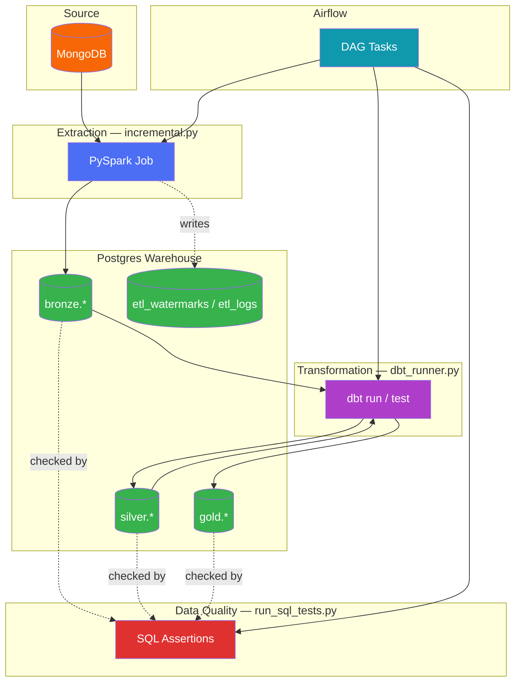
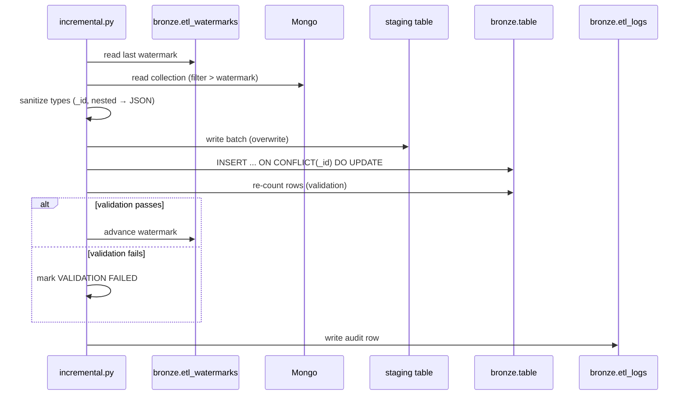
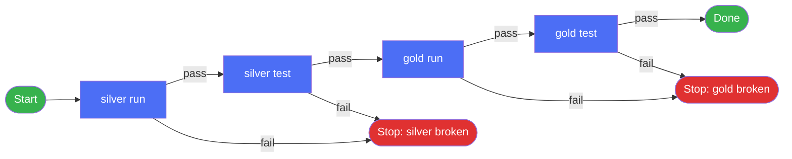

# Architecture — Museum Project

## 1. Overview

museum-etl is a medallion-architecture data platform. A production MongoDB
database is incrementally mirrored into Postgres, cleaned and modeled with
dbt, and checked at every layer by an independent SQL test suite. Apache
Airflow orchestrates the sequence; Docker Compose packages the runtime.

Three scripts carry the actual workload:

| Script | Layer | Responsibility |
|---|---|---|
| `scripts/incremental.py` | Bronze | MongoDB → Postgres load (PySpark) |
| `scripts/dbt_runner.py` | Silver / Gold | dbt build orchestration |
| `scripts/run_sql_tests.py` | Cross-layer | Hand-written SQL data-quality checks |

## 2. System diagram



## 3. Layered data model

| Layer | Contents | Owned by |
|---|---|---|
| **Bronze** | Raw, 1:1 mirror of each Mongo collection, plus `etl_watermarks` and `etl_logs` control tables | `incremental.py` |
| **Silver** | Cleaned, conformed models (`tag:silver` in dbt) | `dbt_runner.py` / `museum_dbt/` |
| **Gold** | Business-ready dimensions and facts (`tag:gold`) consumed by `reports/` | `dbt_runner.py` / `museum_dbt/` |

Every layer is independently testable: dbt tests cover silver/gold, and
`run_sql_tests.py` covers all three with hand-written invariants that don't
depend on dbt's test framework.

## 4. Extraction design (`incremental.py`)

**Collection discovery.** No hardcoded table list — every user collection in
the Mongo database is discovered at runtime (`--tables` restricts this when
needed).

**Watermark detection.** Per collection, the first column present out of
`updated_at → updated_timestamp → created_at → created_timestamp` becomes the
incremental filter, so records modified after insert are re-synced, not just
new ones. A collection with none of these always does a full reload.

**Upsert, not append.** Each batch lands in a scratch staging table, then a
single `INSERT ... ON CONFLICT ("_id") DO UPDATE` merges it into the real
table. The `xmax = 0` trick splits the result into exact inserted/updated
counts in one statement, without a separate Spark-side join.



**Type handling.** Every column keeps whatever type Spark infers from Mongo.
The two unavoidable exceptions: `_id` (ObjectId) becomes a string merge key,
and any nested struct/array/map field is serialized to a JSON string, since
plain JDBC has no native equivalent.

**Post-load validation.** After every write, the target table is re-counted
independently of whatever the write step reported, and compared against the
expected count. Only a `PASS` advances the watermark — a silent partial write
never gets treated as a successful incremental run.

**Control tables** (both in `bronze`, queryable with any SQL client):

| Table | Purpose |
|---|---|
| `etl_watermarks` | One row per collection — last watermark value, last run mode, last inserted/updated counts |
| `etl_logs` | One audit row per collection per run — full detail, including errors, for every run ever executed |

**Safety checks before any Spark work happens:** local jars only (no network
access at runtime), with an explicit Scala-build/PySpark-major-version check
so a mismatch fails fast with one clear message instead of a cryptic
`NoSuchMethodError` repeated per collection.

## 5. Transformation design (`dbt_runner.py`)

Runs the dbt layer strictly in order — **silver run → silver test → gold
run → gold test** — and stops immediately on the first failure, so a broken
silver layer is never built on top of in gold.



Layers are selected by dbt tag (`tag:silver`, `tag:gold`), not by listing
model files, so new models are picked up automatically as long as they carry
the right tag. The dbt project directory is auto-detected by walking upward
for `dbt_project.yml`; `--project-dir` overrides this. Every stage's raw dbt
output is streamed live and also saved to a timestamped log file, and a
summary table is printed at the end.

## 6. Data quality layer (`run_sql_tests.py`)

A second, independent test mechanism alongside dbt's own tests — plain
hand-written SQL files, one test per `.sql` file, auto-discovered from
`tests/<layer>/`. Nothing to register: drop a file in, it runs.

**Convention:** each test only raises an exception on failure and does
nothing on success (typically a `DO $$ ... RAISE EXCEPTION ... $$` block).
Every test executes inside its own transaction, so a failure rolls back
cleanly and can't corrupt state for the next test.

| Outcome | Meaning |
|---|---|
| No exception | `PASS` |
| `RAISE EXCEPTION` caught | `FAIL` (the exception message is the failure detail) |
| Any other DB error | `ERROR` (bad SQL, connection issue — flagged separately from a real check failure) |

All tests always run — one failure never skips the rest — and every failure
is collected into a single aggregate error raised at the very end, so nothing
gets buried in the middle of a long log. Layers run `bronze → silver → gold`
first when present, then any other subfolders alphabetically.

## 7. Reliability & idempotency principles

- **Incremental with automatic fallback.** No watermark column → full reload,
  by design, rather than silently loading nothing.
- **Upsert over append.** Re-running a batch is safe; it never duplicates
  rows.
- **Independent validation.** The row count that decides success is a fresh
  `COUNT(*)`, not a number carried over from the write step.
- **Full audit trail.** Every run, per collection, is logged to
  `bronze.etl_logs` regardless of outcome.
- **Fail fast, fail loud.** The dbt chain stops at the first broken stage;
  the SQL test suite does the opposite on purpose — it always runs
  everything and reports every failure together, since these are independent
  checks rather than a dependency chain.
- **No network at Spark runtime.** JDBC/connector jars are local files in
  `jars/`, checked for version compatibility before a Spark session starts.

## 8. Where this runs

These scripts execute inside the `airflow-worker` container (see
`docker/Dockerfile`), invoked as `uv run scripts/<name>.py ...` by Airflow
tasks. For that to work, the image must contain `scripts/`, `utils/`,
`museum_dbt/`, `tests/`, and `jars/` — not just the dbt project. See the note
at the end of this conversation regarding the current Dockerfile/compose.yml
copy paths.

```
museum/
├── scripts/              incremental.py, dbt_runner.py, run_sql_tests.py
├── utils/                 shared connection/engine/logger helpers
├── museum_dbt/             dbt project (silver + gold models)
├── tests/                  hand-written SQL checks (bronze/silver/gold/...)
├── jars/                   local Spark + Mongo + Postgres JDBC jars
├── logs/                   per-run logs from every script
├── airflow/                 DAGs that call the scripts above
└── docker/                  Dockerfile, compose.yml, entrypoint.sh
```

## 9. Extending the platform

| To do this | Do this |
|---|---|
| Mirror a new Mongo collection | Nothing — it's auto-discovered on the next run |
| Add a silver/gold model | Tag it `silver` or `gold` in dbt; `dbt_runner.py` picks it up automatically |
| Add a data-quality check | Drop a `.sql` file under `tests/<layer>/`; no registration needed |
| Force a specific watermark column | `--watermark-column` on `incremental.py` |
| Rebuild everything from scratch | `--full-refresh` on `incremental.py` and/or `dbt_runner.py` |