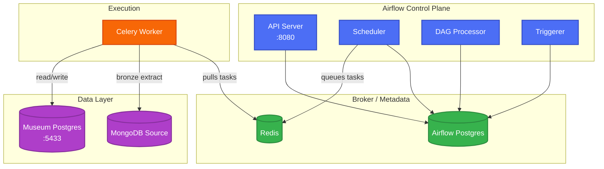
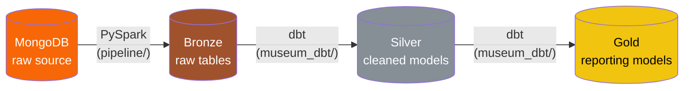
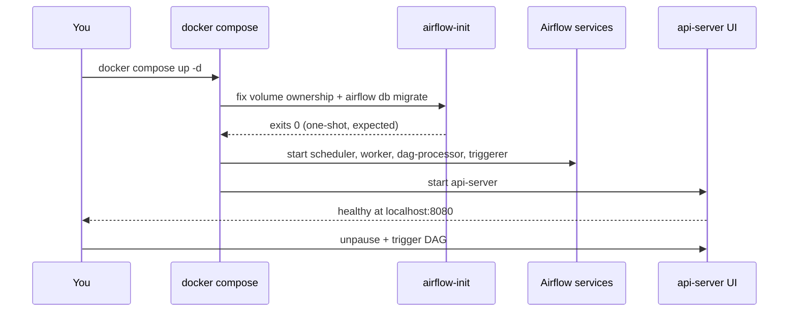

# Docker Setup — Museum Project

How the containers fit together and how data actually moves through them.

## Where things live

```
museum/                  ← project root (build context = "..")
├── airflow/               dags, logs, plugins, config  (bind-mounted)
├── museum_dbt/            dbt project (silver/gold)     → /opt/airflow/dbt
├── pipeline/              PySpark jobs (bronze)         → /opt/airflow/spark_jobs
├── docker/
│   ├── Dockerfile
│   ├── compose.yml
│   ├── entrypoint.sh
│   └── requirements.txt
└── .env                   MUSEUM_PG_*, MONGO_URI, AIRFLOW_UID
```

Compose is run from `docker/`, but the build **context is the parent folder**, so the
`Dockerfile` can `COPY` `museum_dbt/` and `pipeline/` even though they live outside `docker/`.

## Files in docker/

| File | Purpose |
|---|---|
| `Dockerfile` | Builds the custom Airflow image: base `apache/airflow:3.3.1-python3.12` + Java (for PySpark) + `uv`-installed Python packages, with `museum_dbt/` and `pipeline/` baked in so tasks don't depend on a volume being mounted. |
| `compose.yml` | Defines the full stack — two Postgres instances, Redis, and the five Airflow services — using a shared YAML anchor (`x-airflow-common`) so image, env vars, and volumes aren't repeated per service. |
| `entrypoint.sh` | Runs before Airflow starts. Waits for both Postgres instances and Redis to be reachable, tails the auto-generated admin password to logs, then hands off to Airflow's own entrypoint with whatever command Compose passed. |
| `requirements.txt` | Extra Python packages on top of the base image: `pyspark` + `pymongo` (bronze extraction), `dbt-core` + `dbt-postgres` (silver/gold transforms), `psycopg2-binary` (warehouse driver). |

## Container map

Every Airflow service shares **one image** (`museum-airflow:latest`) and reads the
**same environment block**. Only the startup `command` differs.



**Why two Postgres containers?** `postgres` is Airflow's own metadata DB (task
state, connections, etc). `museum-postgres` is the actual data warehouse. Keeping
them separate means a DAG bug can never accidentally write into Airflow's own
internals.

## Medallion data flow (what a DAG run actually does)



Bronze = raw copy, Silver = cleaned/conformed, Gold = business-ready tables that
`reports/` reads from.

## Startup sequence



`airflow-init` **exiting** is correct — it's not a crash, it's a one-shot job.
Every other service should show `Up`/`healthy`.

## Service reference

| Service | Role | Notes |
|---|---|---|
| `airflow-api-server` | Web UI + REST API | Port `8080` → host |
| `airflow-scheduler` | Decides what runs, when | No DAG parsing in Airflow 3 |
| `airflow-dag-processor` | Parses DAG files | Required — separate from scheduler now |
| `airflow-triggerer` | Handles deferred/async tasks | |
| `airflow-worker` | Actually executes tasks | Runs PySpark + dbt shell-outs |
| `redis` | Celery broker | Task queue |
| `postgres` | Airflow metadata DB | Not your data |
| `museum-postgres` | Warehouse (bronze/silver/gold) | Host port `5433` |
| `airflow-init` | One-time DB migrate + perms | Exits after running |
| `airflow-cli` | Ad-hoc `airflow` commands | `profiles: [debug]`, not started by default |

## Environment variables (`.env`, project root)

| Variable | Used for |
|---|---|
| `AIRFLOW_UID` | Host file ownership on mounted volumes |
| `MUSEUM_PG_USER/PASSWORD/DB` | Warehouse connection (Spark + dbt) |
| `MONGO_URI` / `MONGO_DB` | Bronze source connection |

`.env` must sit at the **project root**, since that's the working directory
Compose is invoked relative to (`docker/compose.yml` uses `context: ..`).

## Everyday commands

```bash
# from the docker/ folder
docker compose up -d                       # start everything
docker compose ps                          # check health
docker compose logs -f airflow-worker      # watch task execution

# run once after any fresh volume / first-time setup
docker compose up airflow-init

# ad-hoc Airflow CLI (no long-running container)
docker compose run --rm airflow-cli airflow dags list
docker compose run --rm airflow-cli airflow dags trigger <dag_id>
```

## Common issues

| Symptom | Cause | Fix |
|---|---|---|
| `port is already allocated` | Something else owns `8080` | Free it, or remap `"8081:8080"` |
| `COPY ... not found` during build | `museum_dbt/` or `pipeline/` renamed/missing | Match Dockerfile + compose paths to real folder names |
| DAG not in UI | Import error, or still paused | Check `dag-processor` logs; unpause it |
| Worker can't reach warehouse | `.env` warehouse creds don't match compose defaults | Confirm `MUSEUM_PG_*` matches what `museum_dbt/`'s `profiles.yml` expects |