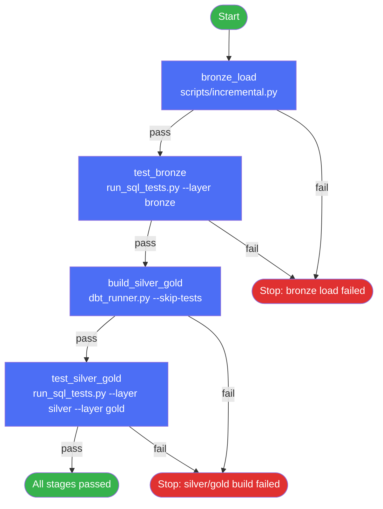

# Pipeline Runner

`pipeline/pipeline_runner.ps1` runs the entire museum pipeline locally, in
one command, in the exact same stage order as the Airflow DAG
(`dags/museum_pipeline.py`). It exists so you can reproduce a full DAG run
on your own machine without going through Airflow at all — useful for local
development, debugging, or a one-off manual run.

## What it runs, in order



Every stage is a plain `uv run scripts/<name>.py` call from the project root.
If a stage fails, the runner stops immediately — a broken bronze load never
gets built on top of in silver/gold, same fail-fast rule the DAG and
`dbt_runner.py` both follow.

## Stage reference

| Stage | Command | Skipped by |
|---|---|---|
| `bronze_load` | `uv run scripts/incremental.py` | — (always runs) |
| `test_bronze` | `uv run scripts/run_sql_tests.py --layer bronze` | `-SkipTests` |
| `build_silver_gold` | `uv run scripts/dbt_runner.py --skip-tests` | `-BronzeOnly` |
| `test_silver_gold` | `uv run scripts/run_sql_tests.py --layer silver --layer gold` | `-SkipTests` or `-BronzeOnly` |

`build_silver_gold` calls `dbt_runner.py` with `--skip-tests` on purpose —
dbt's own model tests are skipped here because `test_silver_gold` runs the
project's separate hand-written SQL checks instead, right after the build.

## Flags

| Flag | Effect |
|---|---|
| `-SkipTests` | Skip both test stages; only load and build |
| `-BronzeOnly` | Stop after `test_bronze` — don't touch silver/gold |
| `-FullRefresh` | Passes `--full-refresh` through to `incremental.py` and `dbt_runner.py` |
| `-ProjectRoot <path>` | Override the auto-detected project root (default: the script's own parent folder) |

## Usage

```powershell
./pipeline/pipeline_runner.ps1                 # full pipeline
./pipeline/pipeline_runner.ps1 -SkipTests      # load + build only, no data-quality checks
./pipeline/pipeline_runner.ps1 -BronzeOnly     # bronze_load + test_bronze only
./pipeline/pipeline_runner.ps1 -FullRefresh    # forces a full reload through the whole chain
```

## What you get while it runs

- Each stage's output streams live to the terminal **and** is saved to
  `logs/<stage>_<timestamp>.log`.
- A pass/fail + duration + log path is recorded per stage.
- A summary table prints at the end, covering every stage that ran (even if
  the run stopped early on a failure).
- Exit code `0` if every stage passed, `1` if any stage failed.

## Note

`test_silver_gold` calls `run_sql_tests.py --layer silver --layer gold`.
`--layer` is a repeatable flag (`action="append"` in `run_sql_tests.py`), so
this correctly runs both layers' checks — not just the last one passed.