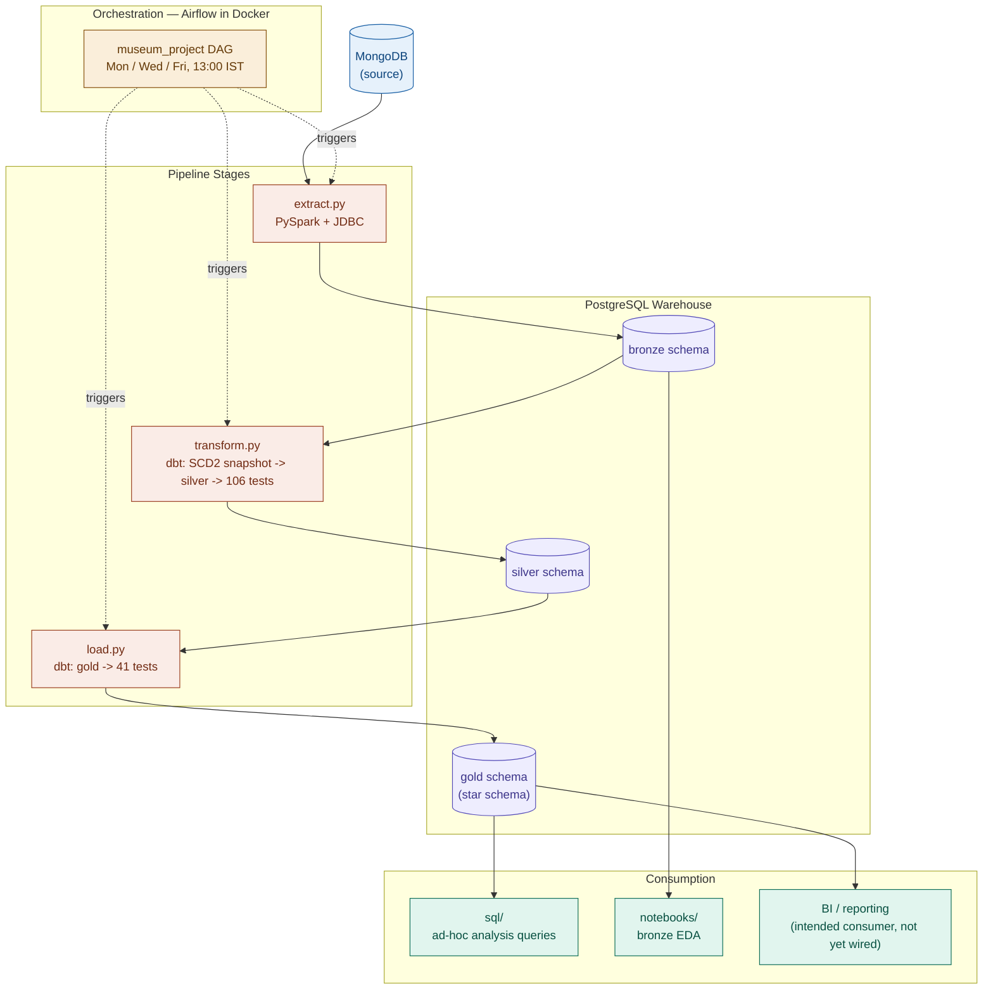
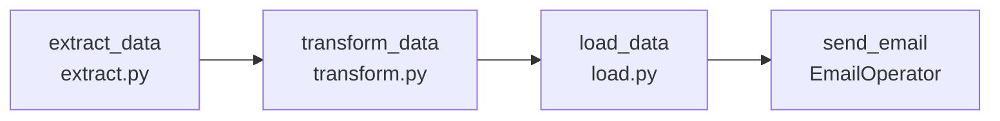
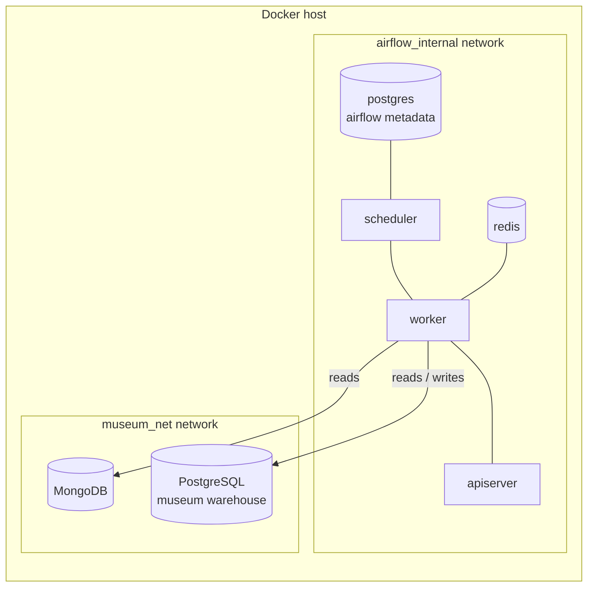

# System Architecture — Museum Art Sales Pipeline

## 1. Purpose and Scope

This document is the entry point for understanding the system as a whole: what it does, how data moves through it, what runs where, and how the pieces fit together. It does not repeat the full detail already covered elsewhere in `docs/` — it summarizes each concern and points to the document that owns it.

| Document | Owns |
|---|---|
| `docs/incremental.md` | Watermark and merge mechanics between bronze and silver |
| `docs/star_schema.md` | Gold-layer dimensional model (ERD, relationships) |
| `docs/data_catlog.md` | Column-level catalog and business rules for every gold table |
| `docs/docker.md` | Container build, Airflow services, networks, volumes, startup/teardown |

**System summary:** a scheduled batch pipeline that extracts museum, artist, artwork, and sales data from MongoDB, lands it in PostgreSQL through a bronze/silver/gold medallion architecture, and exposes a star schema in `gold` for analysis. The whole pipeline is orchestrated by Apache Airflow running in Docker, three times a week.

**Out of scope for this system:** real-time/streaming ingestion, a BI/dashboard layer (gold is the intended consumption point, but no dashboard tool is wired into this repository today), and multi-tenant or multi-region concerns — this is a single-warehouse, single-schedule pipeline.

---

## 2. Design Principles

- **Medallion separation of concerns.** Bronze is a faithful, minimally-typed copy of the source. Silver is where casting, cleaning, deduplication, and incremental logic live. Gold is disposable and rebuilt — it is never a target for incremental writes, so it carries no merge risk.
- **Idempotent loads.** Both layers re-run safely: bronze upserts on a row identity (PK or row-hash), silver merges on a `unique_key`. Re-running a batch twice produces the same end state as running it once.
- **Fail fast on configuration, fail loud on data quality.** `configs/connection.py` raises immediately at import time if required environment variables are missing. dbt test gates (95% pass rate) stop bad data from reaching gold rather than alerting after the fact.
- **Defensive deduplication at every layer.** Source data (MongoDB) is known to contain duplicate keys; both the Python extraction layer and the dbt silver layer deduplicate independently rather than trusting the layer below.
- **Documentation lives next to the thing it describes, and this file is the map between those documents** — not a duplicate of them.

---

## 3. High-Level Architecture



---

## 4. Medallion Layers

| Layer | Schema | Materialization | Built by | Responsibility |
|---|---|---|---|---|
| Bronze | `bronze` | Append/upsert (PySpark + JDBC) | `extract.py` | Raw landing zone. One table per MongoDB collection, columns typed as `TEXT`, one row per source document (or per distinct row-hash for no-PK collections). |
| Silver | `silver` | `incremental`, `merge` (dbt) | `transform.py` | Typed, cleaned, deduplicated, current-state tables — plus SCD Type 2 snapshots for historical change tracking. One row per business key. |
| Gold | `gold` | `table` (full rebuild, dbt) | `load.py` | Analytics-ready star schema: four dimensions + one fact, rebuilt in full on every run from silver. |

Full mechanics of the bronze-to-silver watermark and merge logic are in `docs/incremental.md`. Full column-level detail for every gold table is in `docs/data_catlog.md`.

---

## 5. Technology Stack

| Component | Technology | Role |
|---|---|---|
| Source database | MongoDB | System of record for artist, artwork, museum, and sales documents |
| Extraction engine | PySpark (local mode) | Reads Mongo collections, applies watermark filter and dedup, writes via JDBC |
| Mongo driver | PyMongo | Collection discovery and document reads |
| Postgres driver (Spark) | `postgresql.jar` (JDBC) | Required because Spark cannot use `psycopg2` directly for writes |
| Postgres driver (Python) | `psycopg2-binary` | Used by `utils/engine.py` for plain SQL execution (merge, schema DDL) |
| Connection pooling | SQLAlchemy | `postgres_engine()` — pooled, pre-ping-checked Postgres connections |
| Warehouse database | PostgreSQL | Hosts `bronze`, `silver`, `gold` schemas (museum data) |
| Transformation/testing | dbt (Postgres adapter) | Silver and gold model builds, schema tests, snapshots |
| dbt package | `dbt_utils` | Surrogate key generation (`generate_surrogate_key`) in `fct_sales` |
| Orchestrator | Apache Airflow 3.x | DAG scheduling, retries, task dependency graph |
| Task queue | Celery + Redis 7.2 | Distributes DAG tasks to workers |
| Airflow metadata store | PostgreSQL 13 (separate instance) | DAG state, task history — fully isolated from the museum warehouse |
| Container runtime | Docker / Docker Compose | Builds and runs all nine services |
| JVM runtime | OpenJDK 17 (headless) | Required by PySpark inside the Airflow worker image |

---

## 6. Repository Layout

```
Museum
├─ airflow/                  Airflow image, compose file, DAG, config
│  ├─ config/airflow.cfg
│  ├─ dags/pipeline.py        the museum_project DAG
│  ├─ docker-compose.yaml
│  └─ Dockerfile
├─ configs/
│  └─ connection.py           env-driven DB credentials, fail-fast on import
├─ datasets/                  static/seed input data
├─ docs/                      this folder
│  ├─ data_catlog.md
│  ├─ docker.md
│  ├─ incremental.md
│  ├─ star_schema.md
│  └─ Architecture.md         (this file)
├─ drivers/
│  └─ postgresql.jar          JDBC driver for Spark -> Postgres writes
├─ main.py                    project-level entry point
├─ museum_dbt/                dbt project
│  ├─ models/
│  │  ├─ bronze/source.yml
│  │  ├─ silver/                7 incremental models + schema.yml
│  │  └─ gold/                  4 dims + fct_sales + schema.yml
│  ├─ macros/generate_schema.sql   custom schema-naming macro
│  ├─ snapshots/                 SCD Type 2 snapshot definitions
│  └─ tests/
│     ├─ generic/not_negative.sql
│     ├─ silver/assert_*.sql      one singular test per silver model
│     └─ gold/assert_*.sql        one singular test per gold model
├─ notebooks/
│  └─ museum_bronze_eda.ipynb
├─ scripts/
│  ├─ extraction/extract.py + backfill_timestamps.py
│  ├─ transformation/transform.py
│  └─ loading/load.py
├─ sql/                       20 numbered ad-hoc analysis queries against gold
└─ utils/
   ├─ engine.py                Postgres/Mongo connection factories
   └─ logger.py                shared stage-aware logger
```

| Folder | Purpose |
|---|---|
| `airflow/` | Everything needed to build and run the orchestrator in Docker |
| `configs/` | Centralized environment/credential loading for all scripts |
| `docs/` | Architecture and reference documentation (this folder) |
| `drivers/` | Third-party binary dependency (JDBC jar), not committed in practice |
| `museum_dbt/` | The dbt project: silver/gold models, snapshots, and tests |
| `notebooks/` | Exploratory analysis during development, not part of the automated run |
| `scripts/` | The three pipeline stage entry points called by the DAG |
| `sql/` | Hand-written analysis queries against the finished gold schema |
| `utils/` | Shared infrastructure code (connections, logging) used by all three scripts |

---

## 7. Pipeline Stage Detail

### 7.1 Extraction — `extract.py` (bronze)

Reads each MongoDB collection independently via PySpark, applies a per-collection JSON watermark filter, deduplicates, and writes to a staging table before merging into `bronze` — upserting on a primary key where one exists, or skipping exact duplicates by row-hash where it doesn't (`museum_hours`, `product_size`). Supports `--collection` filtering and `--full-refresh`. See `docs/incremental.md` section 2 for the full mechanism.

### 7.2 Transformation — `transform.py` (silver)

Runs in three steps:
1. Builds dbt **SCD Type 2 snapshots** over bronze — a historical change-tracking layer, independent of the current-state silver tables.
2. Builds the seven incremental silver models (`artist`, `canvas_size`, `museum`, `museum_hours`, `product_size`, `subject`, `work`), each deduplicating and merging on its business key. See `docs/incremental.md` section 3.
3. Runs **106 dbt tests** against silver, gated at a 95% pass rate (two known warnings accepted — see section 10 below).

### 7.3 Loading — `load.py` (gold)

Rebuilds the four dimension tables and `fct_sales` as full `table` materializations from silver, then runs **41 dbt tests**, also gated at 95% — but with zero warnings expected in gold (any `WARN` here is treated as a real problem). See `docs/star_schema.md` and `docs/data_catlog.md` for the dimensional model and column-level rules.

All three scripts exit with code `1` on failure and write a JSON report under `watermark/<stage>/` for the orchestrator to surface.

---

## 8. Orchestration and Deployment

The DAG `museum_project` chains the three stages and a notification step:



- **Schedule:** `0 13 * * MON,WED,FRI` (1:00 PM IST), `catchup=False`.
- **Retries:** one automatic retry per task, five-minute delay. Failure/retry emails are disabled — diagnostics rely on task logs and the JSON dbt failure reports instead.
- **Notification:** a success email is sent after `load_data` completes.

Deployment topology (condensed — full service/volume breakdown in `docs/docker.md`):



The two networks are intentionally separate: `airflow_internal` is private to the orchestrator's own bookkeeping (its metadata DB and Celery broker), while `museum_net` is the shared network that gives the worker access to the actual data sources. The Airflow metadata Postgres and the museum warehouse Postgres are two different database instances and never share a network.

---

## 9. Configuration and Secrets Management

| Source | Scope | Notes |
|---|---|---|
| `configs/connection.py` + project-root `.env` | Application-level DB credentials (Postgres, Mongo) | Fails fast at import time if a required variable is missing |
| `airflow/.env` | Infrastructure-level secrets (`FERNET_KEY`, `WEBSERVER_SECRET_KEY`) and Docker service-name overrides | `FERNET_KEY` must never change after first boot — it encrypts secrets already stored in the metadata DB |
| `airflow/config/passwords.json` | Hashed Airflow UI admin credentials | Mounted into the API server container |

Neither `.env` file is committed to version control. `drivers/postgresql.jar` is likewise excluded and expected to be downloaded per-environment (or pointed to via `JDBC_JAR_PATH`).

---

## 10. Data Quality and Testing Architecture

| Layer | Test count | Gate | Notes |
|---|---|---|---|
| Silver | 106 | 95% pass rate | Two known `warn`-severity failures accepted (see below) |
| Gold | 41 | 95% pass rate | Zero warnings expected — any `WARN` here is investigated as a real defect |

Testing is layered three ways inside `museum_dbt`:
- **Schema tests** (`schema.yml` in `models/silver` and `models/gold`) — `unique`, `not_null`, `accepted_values`, `relationships`.
- **A custom generic test** (`tests/generic/not_negative.sql`) — used on `sale_price` and `regular_price` in silver.
- **Singular/assert tests** (`tests/silver/assert_*.sql`, `tests/gold/assert_*.sql`) — one bespoke assertion file per model, supplementing what column-level schema tests can express.

Known accepted warnings:
- `canvas_size.height_inches` — 7 source records are missing height; these surface as `NULL` `area_sq_inches` and `'Unknown'` `size_category` in gold rather than failing the build.
- `fct_sales` — 2 records have no matching `product_size` entry; tracked and accepted rather than blocking the load.

Any failing run (below the 95% gate, in either stage) exits with code `1` and writes a JSON report to `watermark/<stage>/dq_failure_<timestamp>.json`.

---

## 11. Analytics and Consumption Layer

- **`sql/`** — twenty numbered, hand-written queries against the gold schema (e.g. average discount by era, revenue by canvas size, top artist by revenue). These are analysis artifacts, not part of the automated DAG.
- **`notebooks/museum_bronze_eda.ipynb`** — exploratory analysis against bronze, used during development rather than production.
- **BI / reporting** — gold's star schema is the intended connection point for a BI tool, but no such connector is configured in this repository today.

---

## 12. Observability and Failure Handling

- **`utils/logger.py`** provides a per-stage logger (`extraction` / `transformation` / `loading`): console output at `INFO`, file output at `DEBUG`, written to `logs/<stage>/<name>_<timestamp>.log`.
- **Exit codes** — every script returns `1` on any failure (connection, merge, or test-gate failure), which Airflow's retry policy and task state both key off.
- **JSON failure reports** under `watermark/<stage>/` give a machine-readable summary of what failed, independent of the log files, intended for orchestrators or future alerting to consume.
- **Airflow-level retries** add one automatic retry (5-minute delay) on top of whatever retry logic exists inside each script.

---

## 13. Known Constraints and Open Items

- `museum_hours`'s incremental filter checks only `updated_at` (not `COALESCE(updated_at, loaded_at)` like every other silver model) — flagged in `docs/incremental.md` section 7, not yet resolved.
- `drivers/postgresql.jar` and both `.env` files are environment-specific and must be (re)created per machine — there is no shared secrets store.
- `scripts/extraction/backfill_timestamps.py` exists in the repository as a utility script but is not part of the `museum_project` DAG task graph — it is a manual/one-off tool, not a scheduled stage.
- No BI layer is currently wired to `gold` — see section 11.

---

## 14. Glossary

| Term | Meaning |
|---|---|
| Medallion architecture | Bronze/silver/gold layering pattern: raw, cleaned, analytics-ready |
| Watermark | A high-water mark (timestamp) used to identify "new since last run" records |
| SCD Type 2 | Slowly Changing Dimension pattern that preserves historical versions of a record rather than overwriting them |
| Surrogate key | A generated key (here, an MD5 hash of business columns) used as a table's primary key instead of a natural key |
| Merge / upsert | A write that inserts new rows and updates existing ones in a single operation, keyed on a unique identifier |
| Grain | The level of detail one row in a table represents (e.g. `fct_sales`'s grain is one artwork-size combination) |