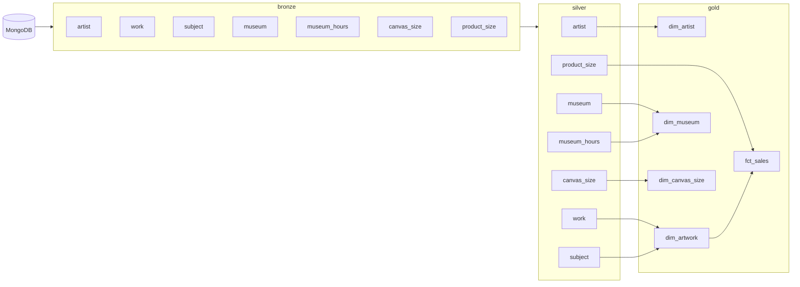

# Data Catalog

**Project:** Museum Art Sales Pipeline
**Last updated:** 2026-06-24
**Maintained by:** Nitin

---

## Overview

This catalog documents every table in the gold layer of the pipeline. The gold layer is the final, analytics-ready output of a three-stage ETL process:

```
MongoDB  →  bronze (raw)  →  silver (cleaned)  →  gold (analytics-ready)
```

All gold tables are built and tested by dbt, materialized as physical tables in PostgreSQL, and pass a 95% data quality gate before being considered production-ready.

---

## Table Index

| Table | Type | Rows (grain) | Source |
|-------|------|-------------|--------|
| [`fct_sales`](#fct_sales) | Fact | One per artwork × canvas size | `product_size` (silver) |
| [`dim_artwork`](#dim_artwork) | Dimension | One per artwork | `work`, `subject` (silver) |
| [`dim_artist`](#dim_artist) | Dimension | One per artist | `artist` (silver) |
| [`dim_museum`](#dim_museum) | Dimension | One per museum | `museum`, `museum_hours` (silver) |
| [`dim_canvas_size`](#dim_canvas_size) | Dimension | One per canvas size | `canvas_size` (silver) |

---

## `fct_sales`

**Schema:** `gold`
**Type:** Fact table
**Materialization:** Table
**dbt tags:** `gold`, `fact`

### Description

Central fact table of the star schema. Each row represents a unique listing of one artwork (`work_id`) in one canvas size (`size_id`), along with its pricing details. Artworks with no matching canvas size in `dim_canvas_size` are excluded. Duplicate `(work_id, size_id)` pairs from the source are de-duplicated by keeping the most recent `updated_at`.

### Columns

| Column | Type | Key | Nullable | Description |
|--------|------|-----|----------|-------------|
| `sales_key` | string | PK | No | Surrogate key — MD5 hash of `work_id + size_id` |
| `work_id` | string | FK | No | References `dim_artwork.work_id` |
| `artist_id` | string | FK | Yes | References `dim_artist.artist_id` (sourced via `dim_artwork`) |
| `museum_id` | string | FK | Yes | References `dim_museum.museum_id`. NULL if artwork is not in a museum |
| `size_id` | string | FK | No | References `dim_canvas_size.size_id` |
| `sale_price` | numeric | | Yes | Discounted selling price |
| `regular_price` | numeric | | Yes | Full list price before discount |
| `discount_amount` | numeric | | Yes | `regular_price − sale_price`, rounded to 2 dp |
| `discount_pct` | numeric | | Yes | Discount as % of regular price, rounded to 2 dp. NULL if `regular_price` is NULL or 0 |
| `is_in_museum` | boolean | | No | `TRUE` if `museum_id` is not NULL, else `FALSE` |
| `source_updated_at` | timestamp | | Yes | Last `updated_at` from the source `product_size` record |
| `gold_loaded_at` | timestamp | | No | Timestamp when the row was written to gold (`CURRENT_TIMESTAMP`) |

### Business Rules

- Only `size_id` values that exist in `dim_canvas_size` are included.
- When the same `(work_id, size_id)` pair appears multiple times in source, the record with the latest `updated_at` is kept (`ROW_NUMBER() OVER ... ORDER BY updated_at DESC`).
- `discount_pct` is NULL when `regular_price` is NULL or zero to avoid division errors.
- `is_in_museum` is derived — not sourced — and is always populated.

### Data Quality Tests (dbt)

| Test | Description |
|------|-------------|
| `unique` | `sales_key` must be unique |
| `not_null` | `sales_key`, `work_id`, `size_id` must not be null |
| `relationships` | `work_id` must exist in `dim_artwork` |
| `relationships` | `size_id` must exist in `dim_canvas_size` |
| `accepted_values` | `is_in_museum` must be `TRUE` or `FALSE` |

---

## `dim_artwork`

**Schema:** `gold`
**Type:** Dimension table
**Materialization:** Table
**dbt tags:** `gold`, `dimension`

### Description

One row per artwork. Built from the silver `work` table and enriched with aggregated subject tags from the silver `subject` table (comma-separated, ordered alphabetically). Artworks with a NULL `work_id` are excluded.

### Columns

| Column | Type | Key | Nullable | Description |
|--------|------|-----|----------|-------------|
| `work_id` | string | PK | No | Unique artwork identifier |
| `artwork_name` | string | | Yes | Title of the artwork |
| `style` | string | | Yes | Artistic style. NULL if blank or missing (not coerced to `'Unknown'`) |
| `subject_tags` | string | | No | Comma-separated subject list, e.g. `"Landscape,Nature"`. `'Unknown'` if no subjects exist |
| `artist_id` | string | FK | Yes | References `dim_artist.artist_id` |
| `museum_id` | string | FK | Yes | References `dim_museum.museum_id`. NULL if not displayed in a museum |

### Business Rules

- `subject_tags` is aggregated with `STRING_AGG(subject, ',' ORDER BY subject)` — subjects are always sorted alphabetically.
- `style` uses `NULLIF(TRIM(style), '')` — blank strings are converted to NULL, not `'Unknown'`.
- Artworks with `work_id IS NULL` are filtered out at source.

### Data Quality Tests (dbt)

| Test | Description |
|------|-------------|
| `unique` | `work_id` must be unique |
| `not_null` | `work_id` must not be null |
| `relationships` | `artist_id` must exist in `dim_artist` (when not null) |
| `relationships` | `museum_id` must exist in `dim_museum` (when not null) |

---

## `dim_artist`

**Schema:** `gold`
**Type:** Dimension table
**Materialization:** Table
**dbt tags:** `gold`, `dimension`

### Description

One row per artist. Built from the silver `artist` table. Includes two computed classification columns — `era` and `artist_status` — designed for BI slicing and filtering. Artists with a NULL `artist_id` are excluded.

### Columns

| Column | Type | Key | Nullable | Description |
|--------|------|-----|----------|-------------|
| `artist_id` | string | PK | No | Unique artist identifier |
| `artist_name` | string | | Yes | Full name of the artist |
| `nationality` | string | | No | Country of origin. `'Unknown'` if missing |
| `style` | string | | No | Artistic style. `'Unknown'` if missing |
| `birth_year` | int | | Yes | Year of birth |
| `death_year` | int | | Yes | Year of death. NULL if living or unknown |
| `era` | string | | No | Computed era label based on `birth_year` — see buckets below |
| `artist_status` | string | | No | `'Historical'` if `death_year` is not NULL, else `'Living / Unknown'` |

### Era Classification

| Birth Year Range | `era` Value |
|-----------------|-------------|
| NULL | `Unknown` |
| < 1400 | `Medieval & Earlier` |
| 1400 – 1599 | `Renaissance` |
| 1600 – 1749 | `Baroque & Rococo` |
| 1750 – 1849 | `Neoclassical & Romantic` |
| 1850 – 1899 | `Impressionist Era` |
| 1900 – 1949 | `Modern` |
| ≥ 1950 | `Contemporary` |

### Business Rules

- `nationality` and `style` are coerced to `'Unknown'` via `COALESCE` — they are never NULL in gold.
- `era` is always populated — NULL `birth_year` maps to `'Unknown'`.
- `artist_status` is always populated — it reflects whether a `death_year` exists, not whether the artist is confirmed living.

### Data Quality Tests (dbt)

| Test | Description |
|------|-------------|
| `unique` | `artist_id` must be unique |
| `not_null` | `artist_id`, `nationality`, `style`, `era`, `artist_status` must not be null |
| `accepted_values` | `era` must be one of the 8 defined buckets |
| `accepted_values` | `artist_status` must be `Historical` or `Living / Unknown` |

---

## `dim_museum`

**Schema:** `gold`
**Type:** Dimension table
**Materialization:** Table
**dbt tags:** `gold`, `dimension`

### Description

One row per museum. Built from the silver `museum` table and enriched with aggregated operating hours statistics from the silver `museum_hours` table. Museums with a NULL `museum_id` are excluded. All hours columns are NULL for museums that have no hours data loaded.

### Columns

| Column | Type | Key | Nullable | Description |
|--------|------|-----|----------|-------------|
| `museum_id` | string | PK | No | Unique museum identifier |
| `museum_name` | string | | Yes | Full name of the museum |
| `city` | string | | No | City. `'Unknown'` if missing |
| `state` | string | | Yes | State or region |
| `country` | string | | No | Country. `'Unknown'` if missing |
| `address` | string | | Yes | Street address |
| `phone` | string | | Yes | Contact phone number |
| `url` | string | | Yes | Museum website URL |
| `opening_days_per_week` | int | | No | Number of days per week the museum is open. `0` if no hours data |
| `avg_daily_open_hours` | numeric | | Yes | Average open hours per day across the week, rounded to 2 dp |
| `earliest_open_time` | time | | Yes | Earliest opening time across all operating days |
| `latest_close_time` | time | | Yes | Latest closing time across all operating days |
| `is_open_weekends` | boolean | | Yes | `TRUE` if open Saturday or Sunday. `FALSE` if hours exist but weekend is closed. NULL if no hours data |

### Business Rules

- Hours stats are computed only from rows where both `open_time` and `close_time` are not NULL.
- `avg_daily_open_hours` is computed as `EXTRACT(EPOCH FROM (close_time - open_time)) / 3600`, rounded to 2 dp.
- `opening_days_per_week` defaults to `0` (not NULL) via `COALESCE` when no hours are loaded.
- `city` and `country` are coerced to `'Unknown'` — never NULL in gold.

### Data Quality Tests (dbt)

| Test | Description |
|------|-------------|
| `unique` | `museum_id` must be unique |
| `not_null` | `museum_id`, `city`, `country`, `opening_days_per_week` must not be null |

---

## `dim_canvas_size`

**Schema:** `gold`
**Type:** Dimension table
**Materialization:** Table
**dbt tags:** `gold`, `dimension`

### Description

One row per canvas size. Built from the silver `canvas_size` table. Includes two computed columns — `area_sq_inches` and `size_category` — for easy BI sorting and grouping. Canvas sizes with a NULL `size_id` are excluded.

> **Note:** 7 records are missing `height_inches` in the source data. This is a known source-data gap documented as an acceptable warning in the silver layer. These records have `area_sq_inches = NULL` and `size_category = 'Unknown'` in gold.

### Columns

| Column | Type | Key | Nullable | Description |
|--------|------|-----|----------|-------------|
| `size_id` | string | PK | No | Unique canvas size identifier |
| `label` | string | | No | Human-readable size name. `'Unknown'` if missing |
| `width_inches` | numeric | | Yes | Width in inches |
| `height_inches` | numeric | | Yes | Height in inches. NULL for 7 known source records |
| `area_sq_inches` | numeric | | Yes | `width_inches × height_inches`, rounded to 2 dp. NULL if either dimension is missing |
| `size_category` | string | | No | Size bucket — see thresholds below |

### Size Category Thresholds

| `area_sq_inches` Range | `size_category` Value |
|------------------------|----------------------|
| Either dimension NULL | `Unknown` |
| ≤ 400 | `Small` |
| 401 – 1600 | `Medium` |
| 1601 – 4000 | `Large` |
| > 4000 | `Extra Large` |

### Business Rules

- `label` is coerced to `'Unknown'` via `COALESCE` — never NULL in gold.
- `size_category` is always populated — NULL dimensions map to `'Unknown'`.
- `area_sq_inches` is NULL (not 0) when either dimension is missing, to avoid misleading aggregations.

### Data Quality Tests (dbt)

| Test | Description |
|------|-------------|
| `unique` | `size_id` must be unique |
| `not_null` | `size_id`, `label`, `size_category` must not be null |
| `accepted_values` | `size_category` must be one of: `Small`, `Medium`, `Large`, `Extra Large`, `Unknown` |
| `warn: not_null` | `height_inches` — 7 known nulls from source (documented acceptable warning) |

---

## Lineage



---

## Pipeline & Data Quality

| Stage | Tool | Tests | Pass threshold |
|-------|------|-------|---------------|
| Extraction | PySpark + PyMongo | — | — |
| Transformation (silver) | dbt | 106 | 95% (2 known warns accepted) |
| Loading (gold) | dbt | 41 | 95% (0 warns expected) |

On any test failure the pipeline exits with code `1` and writes a JSON report to `watermark/gold/dq_failure_<timestamp>.json`.

---

## Known Data Issues

| Table | Column | Issue | Severity |
|-------|--------|-------|----------|
| `dim_canvas_size` | `height_inches` | 7 records missing height at source | Warn (accepted) |
| `fct_sales` | — | 2 records with no matching `product_size` entry | Warn (accepted, tracked in silver) |
| `dim_artwork` | `work_id` | Source MongoDB has duplicate `work_id` values — de-duped in bronze extraction | Info |