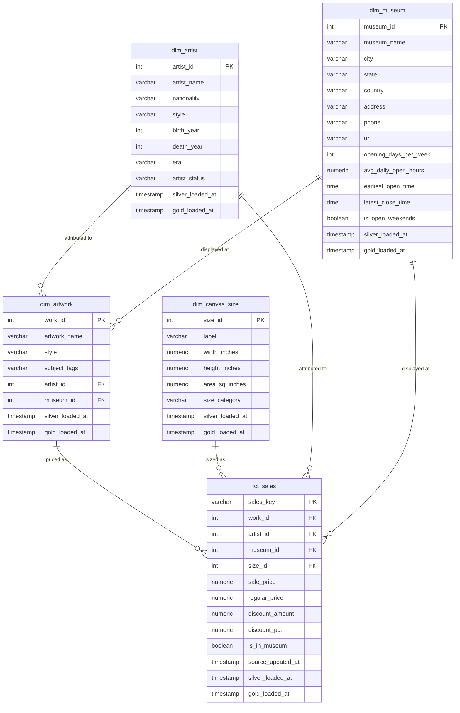

# Data Catalog: Gold Layer

Star schema design: one fact table (`fct_sales`) surrounded by four dimensions. All five models are incremental, using `merge` as the strategy and `silver_loaded_at` as the watermark column, with a 3 day lookback to catch corrections that land after the initial silver load.

## Entity Relationship Diagram

```mermaid
erDiagram
    dim_artist ||--o{ dim_artwork : "attributed to"
    dim_museum ||--o{ dim_artwork : "displayed at"
    dim_artwork ||--o{ fct_sales : "priced as"
    dim_canvas_size ||--o{ fct_sales : "sized as"
    dim_artist ||--o{ fct_sales : "attributed to"
    dim_museum ||--o{ fct_sales : "displayed at"

    dim_artist {
        int artist_id PK
        varchar artist_name
        varchar nationality
        varchar style
        int birth_year
        int death_year
        varchar era
        varchar artist_status
        timestamp silver_loaded_at
        timestamp gold_loaded_at
    }

    dim_artwork {
        int work_id PK
        varchar artwork_name
        varchar style
        varchar subject_tags
        int artist_id FK
        int museum_id FK
        timestamp silver_loaded_at
        timestamp gold_loaded_at
    }

    dim_museum {
        int museum_id PK
        varchar museum_name
        varchar city
        varchar state
        varchar country
        varchar address
        varchar phone
        varchar url
        int opening_days_per_week
        numeric avg_daily_open_hours
        time earliest_open_time
        time latest_close_time
        boolean is_open_weekends
        timestamp silver_loaded_at
        timestamp gold_loaded_at
    }

    dim_canvas_size {
        int size_id PK
        varchar label
        numeric width_inches
        numeric height_inches
        numeric area_sq_inches
        varchar size_category
        timestamp silver_loaded_at
        timestamp gold_loaded_at
    }

    fct_sales {
        varchar sales_key PK
        int work_id FK
        int artist_id FK
        int museum_id FK
        int size_id FK
        numeric sale_price
        numeric regular_price
        numeric discount_amount
        numeric discount_pct
        boolean is_in_museum
        timestamp source_updated_at
        timestamp silver_loaded_at
        timestamp gold_loaded_at
    }
```

## Table Reference

### dim_artist

One row per artist, enriched with a computed era bucket and a historical vs living flag.

| Field | Grain | Primary Key | Load Pattern |
|---|---|---|---|
| Value | One row per artist_id | artist_id | Incremental merge, watermarked on silver_loaded_at |

| Column | Type | Description |
|---|---|---|
| artist_id | int | Primary key |
| artist_name | varchar | Full name |
| nationality | varchar | Defaults to Unknown |
| style | varchar | Defaults to Unknown |
| birth_year | int | Nullable |
| death_year | int | Null if living or unknown |
| era | varchar | Computed bucket from birth_year |
| artist_status | varchar | Historical or Living / Unknown |
| silver_loaded_at | timestamp | Source freshness column, also the watermark |
| gold_loaded_at | timestamp | When the row was last upserted into gold |

### dim_artwork

One row per artwork, with style, an aggregated subject tag list, and FKs to artist and museum.

| Field | Grain | Primary Key | Load Pattern |
|---|---|---|---|
| Value | One row per work_id | work_id | Incremental merge, watermarked on silver_loaded_at across both work and subject |

| Column | Type | Description |
|---|---|---|
| work_id | int | Primary key |
| artwork_name | varchar | Title of the artwork |
| style | varchar | Null if unknown |
| subject_tags | varchar | Comma separated list, defaults to Unknown |
| artist_id | int | FK to dim_artist, nullable |
| museum_id | int | FK to dim_museum, nullable |
| silver_loaded_at | timestamp | Watermark, from the work row |
| gold_loaded_at | timestamp | When the row was last upserted into gold |

Because subject_tags is an aggregate, a work counts as changed if either its own row changed or any of its subject rows changed. Both sources are checked before the model decides which artworks to recompute.

### dim_museum

One row per museum, enriched with opening hours stats aggregated across the week.

| Field | Grain | Primary Key | Load Pattern |
|---|---|---|---|
| Value | One row per museum_id | museum_id | Incremental merge, watermarked on silver_loaded_at across both museum and museum_hours |

| Column | Type | Description |
|---|---|---|
| museum_id | int | Primary key |
| museum_name | varchar | Full name |
| city | varchar | Defaults to Unknown |
| state | varchar | Null for countries without states |
| country | varchar | Defaults to Unknown |
| address | varchar | Street address |
| phone | varchar | Unique |
| url | varchar | Unique, website |
| opening_days_per_week | int | 0 if no hours loaded |
| avg_daily_open_hours | numeric | Null if no hours loaded |
| earliest_open_time | time | Across all operating days |
| latest_close_time | time | Across all operating days |
| is_open_weekends | boolean | Null if no hours data |
| silver_loaded_at | timestamp | Watermark, from the museum row |
| gold_loaded_at | timestamp | When the row was last upserted into gold |

Same pattern as dim_artwork: the opening hours stats are an aggregate, so a museum counts as changed if either its own row changed or any of its hours rows changed.

### dim_canvas_size

One row per canvas size, with a computed area and a size bucket for BI grouping.

| Field | Grain | Primary Key | Load Pattern |
|---|---|---|---|
| Value | One row per size_id | size_id | Incremental merge, watermarked on silver_loaded_at |

| Column | Type | Description |
|---|---|---|
| size_id | int | Primary key |
| label | varchar | Defaults to Unknown |
| width_inches | numeric | Nullable |
| height_inches | numeric | Nullable |
| area_sq_inches | numeric | Null when either dimension is missing |
| size_category | varchar | Small, Medium, Large, Extra Large, or Unknown |
| silver_loaded_at | timestamp | Source freshness column, also the watermark |
| gold_loaded_at | timestamp | When the row was last upserted into gold |

### fct_sales

Central fact table, one row per artwork by canvas size combination, for pricing, discount, and museum placement analysis.

| Field | Grain | Primary Key | Load Pattern |
|---|---|---|---|
| Value | One row per (work_id, size_id) | sales_key | Incremental merge, watermarked on silver_loaded_at from product_size |

| Column | Type | Description |
|---|---|---|
| sales_key | varchar | Surrogate key built from work_id and size_id |
| work_id | int | FK to dim_artwork |
| artist_id | int | FK to dim_artist, nullable for unattributed works |
| museum_id | int | FK to dim_museum, null if not on display |
| size_id | int | FK to dim_canvas_size |
| sale_price | numeric | Discounted price |
| regular_price | numeric | Full list price |
| discount_amount | numeric | regular_price minus sale_price |
| discount_pct | numeric | Discount as a percentage of regular_price |
| is_in_museum | boolean | True when the artwork has a museum |
| source_updated_at | timestamp | updated_at from the source product_size row |
| silver_loaded_at | timestamp | Watermark, from the product_size row |
| gold_loaded_at | timestamp | When the row was last upserted into gold |