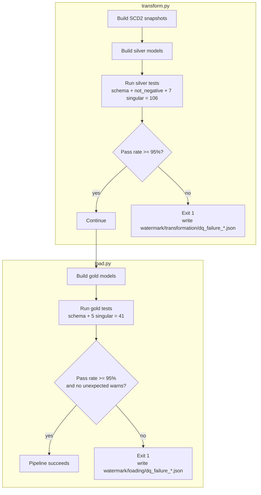

# Data Quality and Testing Strategy

This document covers how data quality is enforced in `museum_dbt` — what gets tested, where each test type is defined, and how the two pass-rate gates fit into the pipeline. Column-level business rules live in `docs/data_catlog.md`; this document is about the testing mechanism itself, not what each column means.

---

## 1. Overview

Testing happens at the end of each dbt-driven stage, not continuously:

| Stage | Run by | Tests | Gate |
|---|---|---|---|
| Silver | `transform.py` | 106 | 95% pass rate (2 known warns accepted) |
| Gold | `load.py` | 41 | 95% pass rate, 0 warns expected |

Both gates sit **after** the models for that layer have been built and **before** the next stage runs — a failing silver gate stops `load.py` from ever running against bad data.

---

## 2. Test Mechanisms

dbt tests in this project come from three places:

| Mechanism | Defined in | Reusable across columns? | Example here |
|---|---|---|---|
| Built-in generic tests | `schema.yml` | Yes | `unique`, `not_null`, `accepted_values`, `relationships` |
| Custom generic test | `tests/generic/not_negative.sql` | Yes, parameterized by column | Applied to `sale_price` and `regular_price` in silver |
| Singular (data) tests | `tests/silver/assert_*.sql`, `tests/gold/assert_*.sql` | No — one file, one assertion | One `assert_<model>.sql` per silver and gold model |

A singular test is a SQL query that should return zero rows; any row it does return counts as one test failure. Built-in and custom generic tests work the same way under the hood — dbt compiles them into the same zero-rows-means-pass query form.

---

## 3. Silver Layer — Schema Tests by Model

| Model | Column | Tests | Notes |
|---|---|---|---|
| `artist` | `artist_id` | `unique`, `not_null` | |
| | `artist_name`, `nationality`, `style`, `birth_year`, `death_year` | `not_null` | |
| | `updated_at`, `loaded_at`, `silver_loaded_at` | `not_null` | |
| `canvas_size` | `size_id` | `unique`, `not_null` | |
| | `width_inches` | `not_null` | |
| | `height_inches` | `not_null` (severity `warn`) | 7 known source nulls — see section 8 |
| | `label`, `updated_at`, `loaded_at`, `silver_loaded_at` | `not_null` | |
| `museum_hours` | `museum_id` | `not_null` | |
| | `day` | `not_null`, `accepted_values` (severity `error`, explicit) | Values restricted to the 7 weekday names |
| | `open_time`, `close_time`, `updated_at`, `silver_loaded_at` | `not_null` | No `loaded_at` column on this model |
| `museum` | `museum_id` | `unique`, `not_null` | |
| | `museum_name`, `city`, `country`, `address` | `not_null` | |
| | `state`, `postal` | none | Nullable by design — not all countries/museums have them |
| | `phone`, `url` | `unique`, `not_null` | |
| | `updated_at`, `loaded_at`, `silver_loaded_at` | `not_null` | |
| `product_size` | `work_id`, `size_id` | `not_null` | |
| | `sale_price`, `regular_price` | `not_null`, `not_negative` | Custom generic test — section 4 |
| | `updated_at`, `loaded_at`, `silver_loaded_at` | `not_null` | |
| `subject` | `work_id`, `subject`, `updated_at`, `loaded_at`, `silver_loaded_at` | `not_null` | |
| `work` | `work_id` | `unique`, `not_null` | |
| | `name` | `not_null` | |
| | `artist_id`, `style`, `museum_id` | none | Nullable by design — unknown artist/style/museum is a valid state |
| | `updated_at`, `loaded_at`, `silver_loaded_at` | `not_null` | |

---

## 4. Custom Generic Test — `not_negative`

Defined once in `tests/generic/not_negative.sql` and reused across both `product_size` numeric columns rather than writing the same check twice. It asserts the column contains no negative values — guarding `sale_price` and `regular_price` against bad casts or source corruption before they reach `fct_sales`, where they feed `discount_amount` and `discount_pct`.

---

## 5. Gold Layer — Schema Tests by Model

| Model | Test | Applies to |
|---|---|---|
| `fct_sales` | `unique` | `sales_key` |
| | `not_null` | `sales_key`, `work_id`, `size_id` |
| | `relationships` | `work_id` → `dim_artwork`, `size_id` → `dim_canvas_size` |
| | `accepted_values` | `is_in_museum` ∈ `{TRUE, FALSE}` |
| `dim_artwork` | `unique`, `not_null` | `work_id` |
| | `relationships` (nullable) | `artist_id` → `dim_artist`, `museum_id` → `dim_museum` |
| `dim_artist` | `unique` | `artist_id` |
| | `not_null` | `artist_id`, `nationality`, `style`, `era`, `artist_status` |
| | `accepted_values` | `era` ∈ 8 defined buckets; `artist_status` ∈ `{Historical, Living / Unknown}` |
| `dim_museum` | `unique`, `not_null` | `museum_id`, `city`, `country`, `opening_days_per_week` |
| `dim_canvas_size` | `unique`, `not_null` | `size_id`, `label`, `size_category` |
| | `accepted_values` | `size_category` ∈ `{Small, Medium, Large, Extra Large, Unknown}` |
| | `not_null` (severity `warn`) | `height_inches` — 7 known nulls, see section 8 |

Unlike silver, no `warn`-severity test in gold is expected to actually fire in a healthy run — gold's only accepted warning is the inherited `height_inches` gap above.

---

## 6. Singular ("assert") Tests

One bespoke SQL assertion exists per model, beyond what column-level schema tests can express:

```
tests/silver/assert_artist.sql
tests/silver/assert_canvas_size.sql
tests/silver/assert_museum.sql
tests/silver/assert_museum_hours.sql
tests/silver/assert_product_size.sql
tests/silver/assert_subject.sql
tests/silver/assert_work.sql

tests/gold/assert_dim_artist.sql
tests/gold/assert_dim_artwork.sql
tests/gold/assert_dim_canvas_size.sql
tests/gold/assert_dim_museum.sql
tests/gold/assert_fct_sales.sql
```

These typically cover things a `unique`/`not_null`/`relationships` test can't — grain checks, cross-column consistency, or business-rule assertions specific to one model. The exact query inside each file isn't reproduced here; this document covers what's tested at the schema level and the aggregate gates. If you want these enumerated with the same level of detail as sections 3 and 5, share the files and I'll extend this document.

---

## 7. Test Execution and Gating Flow



dbt itself does not natively fail a run on a percentage threshold — by default only `error`-severity failures cause a non-zero exit, while `warn`-severity failures are logged but don't fail the command. The 95% pass-rate gate is most likely implemented as a post-processing step in `transform.py`/`load.py` that reads dbt's own results (e.g. `run_results.json`) and computes the threshold itself; that implementation isn't in the docs reviewed for this file, so treat this as an inference rather than a confirmed mechanism.

---

## 8. Known Accepted Exceptions

| Location | Issue | Severity | Status |
|---|---|---|---|
| `canvas_size.height_inches` (silver), inherited by `dim_canvas_size` (gold) | 7 source records missing height | `warn` | Accepted — `area_sq_inches` and `size_category` fall back to `NULL`/`'Unknown'` rather than blocking the build |
| `fct_sales` | 2 records present in `product_size` that don't make it into the fact (likely dropped by the `size_id` ∈ `dim_canvas_size` filter in `fct_sales.sql`) | `warn` | Accepted, tracked in silver — see `sql/09_fct_sales_grain_audit.sql`, which audits this exact kind of gap |
| `museum_hours.day` | `accepted_values` severity is explicitly set to `error` | n/a | Not a relaxation — called out here only because it's the one place severity is spelled out even though it matches the default |

---

## 9. Reconciling the Reported Totals

Adding up everything enumerated in this document:

| Layer | Schema tests (section 3/5) | Singular tests | Documented total |
|---|---|---|---|
| Silver | 59 | 7 | 66 of 106 reported |
| Gold | 30 | 5 | 35 of 41 reported |

The gap between what's enumerated here and the totals reported by `transform.py`/`load.py` (106 and 41) is most likely additional tests on the SCD2 snapshots or bronze sources that weren't included in the `schema.yml` content reviewed for this document. If you share the snapshot and source test definitions, this section can be tightened to a full reconciliation.

---

## 10. Related Documentation

| Document | Covers |
|---|---|
| `docs/Architecture.md` | Where this testing stage sits in the overall pipeline |
| `docs/incremental.md` | How rows reach silver before these tests ever see them |
| `docs/star_schema.md` | The gold model these gold-layer tests protect |
| `docs/data_catlog.md` | What each tested column means and the business rules behind it |