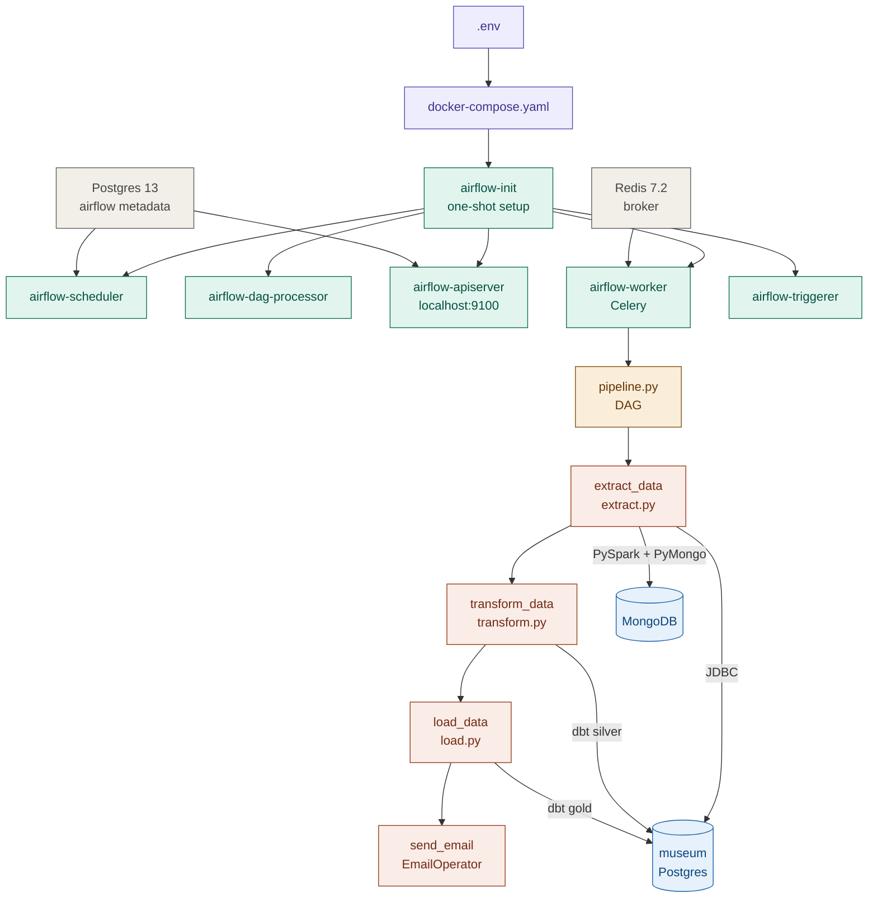
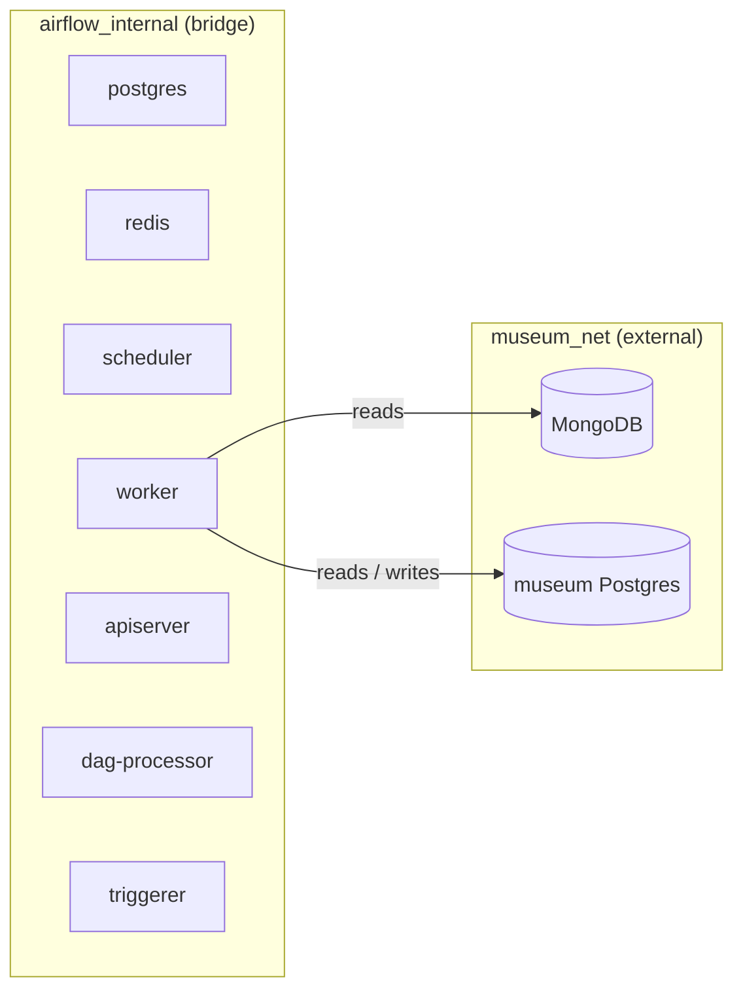
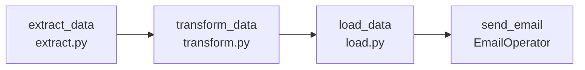

# Docker & Orchestration

This document explains how the pipeline is containerised, how Apache Airflow orchestrates it, and how all the moving parts connect at runtime.

---

## Overview

The pipeline runs inside Docker. Airflow acts as the orchestrator — it schedules the ETL jobs, runs them in the right order, handles retries, and sends an email when a run completes. Everything is wired together with Docker Compose.



---

## File Reference

| File | Purpose |
|------|---------|
| `Dockerfile.airflow` | Builds the custom Airflow image with Java 17 + PySpark |
| `docker-compose.yaml` | Defines all services, networks, and volumes |
| `.env` | Secret keys and service name overrides (not committed) |
| `requirements.airflow.txt` | Python dependencies installed into the image |
| `config/airflow.cfg` | Airflow behaviour configuration |
| `config/passwords.json` | Hashed admin credentials for the UI |
| `dags/pipeline.py` | The Airflow DAG definition |

---

## Custom Docker Image (`Dockerfile.airflow`)

The official `apache/airflow:3.0.2` image doesn't include Java or PySpark. The custom image adds them in layers:

```
apache/airflow:3.0.2  (base)
    └── openjdk-17-jdk-headless  (root — required by PySpark)
        └── pyspark==3.5.1       (own layer — 317 MB, cached separately)
            └── requirements.airflow.txt  (all other deps)
```

**Why separate layers?** PySpark is large and slow to download. Giving it its own `RUN pip install` layer means Docker caches it independently — if you only change `requirements.airflow.txt`, Docker reuses the PySpark layer and only reinstalls the lighter deps. The `--timeout 600 --retries 5` flags prevent the install from failing on slow network connections.

### Python dependencies (`requirements.airflow.txt`)

| Package | Purpose |
|---------|---------|
| `apache-airflow-providers-mongo` | Airflow MongoDB connection hooks |
| `apache-airflow-providers-postgres` | Airflow PostgreSQL connection hooks |
| `apache-airflow-providers-celery` | CeleryExecutor support |
| `pymongo==4.7.2` | MongoDB driver used by `extract.py` |
| `psycopg2-binary==2.9.9` | PostgreSQL driver used by `engine.py` |
| `pandas==2.2.2` | DataFrame utilities in the pipeline |
| `pyarrow==16.1.0` | Columnar memory format used by PySpark ↔ pandas |

> Provider packages (`apache-airflow-providers-*`) are intentionally left unpinned to let Airflow's own constraint file resolve compatible versions for 3.0.x.

---

## Services (`docker-compose.yaml`)

The compose file defines **9 services** split across two networks.

### Infrastructure services

#### `postgres` — Airflow metadata database
A dedicated PostgreSQL 13 instance used **only** by Airflow to store DAG state, task history, connections, and variables. It is completely separate from the museum data PostgreSQL. Lives only on `airflow_internal`.

#### `redis` — Celery message broker
Redis 7.2 acts as the message queue between the scheduler and the Celery worker. When the scheduler decides a task should run, it pushes a message to Redis. The worker picks it up and executes it. Lives only on `airflow_internal`.

### Airflow services

All Airflow services are built from the same custom image and share a common configuration block (`x-airflow-common`) with environment variables and volume mounts.

#### `airflow-init` — one-shot initialiser
Runs once on first boot. It:
- Checks available memory (≥ 4 GB), CPUs (≥ 2), and disk (≥ 10 GB)
- Creates required directories under `/opt/airflow/`
- Runs `airflow db migrate` to set up the metadata schema
- Creates the default admin user
- Sets correct file ownership for the `AIRFLOW_UID`

After completing successfully, all other services start via `depends_on: airflow-init: condition: service_completed_successfully`.

#### `airflow-apiserver` — UI and REST API (port 9100)
In Airflow 3.x the webserver is replaced by the API server, which serves both the web UI and the REST API from the same process. Accessible at `http://localhost:9100`. Exposes `GET /api/v2/version` as its health check endpoint.

#### `airflow-scheduler` — DAG trigger engine
Continuously parses DAGs, evaluates schedule intervals, and decides when to trigger a new DAG run. When a task is ready to run, it places it on the Redis queue for the worker to pick up. Health check runs on port `8974`.

#### `airflow-dag-processor` — DAG file parser (Airflow 3.x)
In Airflow 3.x, DAG file parsing is separated from the scheduler into its own process. It scans the `dags/` folder, imports Python files, and keeps the DAG registry up to date without blocking the scheduler.

#### `airflow-worker` — Celery task executor
Pulls task messages from Redis and executes them. This is where `extract.py`, `transform.py`, and `load.py` actually run. Uses `CeleryExecutor` — if you need more throughput, you scale workers: `docker compose up --scale airflow-worker=3`.

#### `airflow-triggerer` — async deferral support
Handles deferred tasks (tasks that yield control while waiting for an external event, e.g. a sensor). Not used by the current DAG but required by Airflow 3.x.

### Optional services (profiles)

| Service | Profile | Port | Purpose |
|---------|---------|------|---------|
| `airflow-cli` | `debug` | — | Drop into a bash shell inside the Airflow environment |
| `flower` | `flower` | `5555` | Celery Flower UI — monitor worker queues and task history |

Activate with: `docker compose --profile flower up`

---

## Networks



| Network | Type | Purpose |
|---------|------|---------|
| `airflow_internal` | bridge (managed by this compose) | Airflow ↔ Postgres metadata ↔ Redis. Isolated from everything else. |
| `museum_net` | external (pre-existing) | Shared with your museum `docker-compose.yml`. Gives Airflow workers access to MongoDB and the museum PostgreSQL. |

> Before starting, create the shared network once: `docker network create museum_net`
> Then add `networks: [museum_net]` to your MongoDB and museum Postgres services.

---

## Volumes

| Volume / Mount | Container path | Purpose |
|---------------|---------------|---------|
| `postgres-db-volume` (named) | `/var/lib/postgresql/data` | Persists Airflow metadata DB across restarts |
| `./dags` | `/opt/airflow/dags` | DAG files — live-reloaded by the DAG processor |
| `./logs` | `/opt/airflow/logs` | Task execution logs |
| `./config` | `/opt/airflow/config` | `airflow.cfg` + `passwords.json` |
| `./plugins` | `/opt/airflow/plugins` | Custom Airflow plugins |
| `./src` | `/opt/airflow/src` | Pipeline source code (`scripts/`, `utils/`, `configs/`) |
| `./data` | `/opt/airflow/data` | CSV or static input files |

`./src` and `./data` are mounted so the worker can import your pipeline modules without baking them into the image — changes to Python files take effect on the next task run without rebuilding.

---

## Environment Variables (`.env`)

The `.env` file is loaded by Docker Compose and fills in `${...}` placeholders in `docker-compose.yaml`. **It is not committed to version control.**

| Variable | Description |
|----------|-------------|
| `AIRFLOW_UID` | UID for file ownership inside containers. Set to `0` on Windows |
| `FERNET_KEY` | AES encryption key for secrets stored in the metadata DB. Generate once, never change after first boot |
| `WEBSERVER_SECRET_KEY` | Signs session cookies for the API server |
| `MONGO_SERVICE_NAME` | Docker service name for MongoDB (default: `mongo`) |
| `MONGO_DB` | MongoDB database name (default: `museum`) |
| `MUSEUM_PG_SERVICE_NAME` | Docker service name for museum PostgreSQL (default: `postgres`) |
| `MUSEUM_PG_DB` | Museum PostgreSQL database name |
| `MUSEUM_PG_USER` | Museum PostgreSQL username |
| `MUSEUM_PG_PASSWORD` | Museum PostgreSQL password |

**Generating keys:**
```bash
# Fernet key
python -c "from cryptography.fernet import Fernet; print(Fernet.generate_key().decode())"

# Webserver secret key
python -c "import secrets; print(secrets.token_hex(32))"
```

---

## Airflow Configuration (`airflow.cfg`)

Key settings relevant to this pipeline:

| Setting | Value | Reason |
|---------|-------|--------|
| `executor` | `CeleryExecutor` | Enables distributed task execution via Redis + workers |
| `dags_folder` | `/opt/airflow/dags` | Where the DAG processor scans for DAG files |
| `dags_are_paused_at_creation` | `True` | New DAGs don't auto-run — must be manually unpaused |
| `load_examples` | `False` | Keeps the UI clean (no sample DAGs) |
| `parallelism` | `32` | Max total concurrent task instances across all DAGs |
| `max_active_tasks_per_dag` | `16` | Max concurrent tasks within a single DAG |
| `auth_manager` | `SimpleAuthManager` | Username/password login, credentials from `passwords.json` |
| `simple_auth_manager_users` | `admin:admin` | UI user and role definition |

### Authentication (`passwords.json`)

Admin credentials are stored as a hashed JSON file mounted into the API server container:

```
config/passwords.json  →  /opt/airflow/simple_auth_manager_passwords.json.generated
```

The default admin login is `admin` / `b579pr7Aru2vuPUZ` (change this before exposing the UI publicly).

---

## DAG: `museum_project` (`pipeline.py`)

The Airflow DAG that ties the three ETL stages together.

### Schedule

```
0 13 * * MON,WED,FRI   →   1:00 PM IST, Monday / Wednesday / Friday
```

`catchup=False` means Airflow will not backfill missed runs if the pipeline was down.

### Task graph



| Task | Calls | What it does |
|------|-------|-------------|
| `extract_data` | `extract.main()` | Reads MongoDB → writes to `bronze` schema in PostgreSQL via PySpark + JDBC |
| `transform_data` | `transform.main()` | Runs dbt snapshot + silver models + 106 quality tests |
| `load_data` | `load.main()` | Runs dbt gold models + 41 quality tests |
| `send_email` | `EmailOperator` | Sends a success notification to `nitin321x@gmail.com` |

### Retry behaviour

```python
retries      = 1          # one automatic retry on failure
retry_delay  = 5 minutes  # wait 5 min before retrying
```

Email notifications on failure/retry are disabled (`email_on_failure: False`) — the pipeline relies on task logs and dbt failure reports for diagnostics instead.

---

## Startup Guide

```bash
# 1. Create the shared Docker network (once only)
docker network create museum_net

# 2. Copy and fill in your environment file
cp _env .env
# edit .env — set your service names and generate fresh keys

# 3. Build the custom image and start everything
docker compose up --build -d

# 4. Wait for airflow-init to complete (watch logs)
docker compose logs -f airflow-init

# 5. Open the Airflow UI
#    http://localhost:9100
#    Login: admin / b579pr7Aru2vuPUZ

# 6. Unpause the DAG in the UI, or via CLI:
docker compose exec airflow-scheduler airflow dags unpause museum_project

# 7. Trigger a manual run to test
docker compose exec airflow-scheduler airflow dags trigger museum_project
```

### Optional: monitor Celery workers

```bash
# Start Flower (Celery monitor) on port 5555
docker compose --profile flower up -d flower
# Open: http://localhost:5555

# Drop into a debug shell
docker compose --profile debug run airflow-cli
```

### Teardown

```bash
# Stop all services (keeps volumes)
docker compose down

# Stop and delete all data including the metadata DB
docker compose down -v
```

---

## Troubleshooting

| Symptom | Likely cause | Fix |
|---------|-------------|-----|
| Workers can't reach MongoDB or museum Postgres | `museum_net` not created, or your DB services don't declare it | Run `docker network create museum_net` and add it to your DB compose services |
| `ClassNotFoundException: org.postgresql.Driver` | JDBC JAR missing from `drivers/` | Download from https://jdbc.postgresql.org/download/ and place in `drivers/` |
| `AIRFLOW_UID` warnings on Windows | UID mismatch | Set `AIRFLOW_UID=0` in `.env` |
| DAG not appearing in UI | DAG processor hasn't imported it yet, or import error | Check `docker compose logs airflow-dag-processor` |
| Tasks stuck in `queued` state | Worker not connected to Redis, or wrong broker URL | Check `docker compose logs airflow-worker` and verify `CELERY_BROKER_URL` |
| `Fernet key` error after recreating containers | Key changed between runs | Keep the same `FERNET_KEY` in `.env` across restarts — never regenerate after first boot |