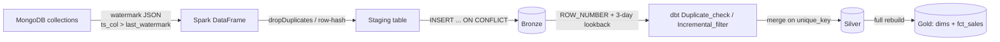

# Incremental Loading Strategy

This pipeline is incremental at **two separate layers**, each with its own watermark and its own reason for existing:

| Layer | Tool | Watermark lives in | Strategy |
|---|---|---|---|
| MongoDB → Bronze | `extract.py` (PySpark) | `watermark/extract/<table>.json` | strict `>` filter, then upsert / row-hash insert |
| Bronze → Silver | dbt (`artist.sql`, `work.sql`, etc.) | `MAX(updated_at)` in the silver table itself | `>=` filter with a 3-day lookback, then `merge` |

Gold (`dim_*`, `fct_sales`) is **not** incremental — it's `materialized='table'`, fully rebuilt every run from the already-deduplicated silver tables. This doc only covers the two incremental layers.

---

## 1. Pipeline overview



---

## 2. Layer 1 — Bronze ingestion (`extract.py`)

Each MongoDB collection is extracted independently, with its own JSON watermark file recording the max `updated_at` seen so far.

**Per-collection key strategy** (`COLLECTION_PK_MAP`):

| Collection | Bronze key | Conflict handling |
|---|---|---|
| `artist`, `museum`, `canvas_size`, `work` | single PK (`*_id`) | `ON CONFLICT (pk) DO UPDATE` — true upsert |
| `subject` | `subject_id` | `ON CONFLICT (subject_id) DO UPDATE` |
| `museum_hours`, `product_size` | **no single PK** | `ON CONFLICT (_row_hash) DO NOTHING` |

The no-PK collections matter a lot for layer 2: since there's no business-key upsert here, **multiple bronze rows can exist for the same `(work_id, size_id)` or `(museum_id, day)`** — one per distinct value combination ever seen (e.g. every time a price changes, a new row lands because its row-hash is different). Bronze for these two tables behaves like an append log per key, not a current-state table.

Other relevant behavior:
- `loaded_at` is stamped once, after the watermark filter, so every row in a given run shares the same pipeline-entry timestamp.
- Watermark filter is **strict `>` with no lookback buffer** — once a doc's `updated_at` has been seen, it's never re-pulled from Mongo.
- `--full-refresh` truncates the bronze table and deletes the watermark JSON, so the next run starts cold.
- Schema evolution is handled by diffing `information_schema.columns` and `ALTER TABLE ADD COLUMN` for any new field.

---

## 3. Layer 2 — Silver models (dbt `incremental` + `merge`)

Every silver model (`artist`, `canvas_size`, `museum`, `museum_hours`, `product_size`, `subject`, `work`) follows the same four-stage shape:

```sql
WITH Duplicate_check AS (
    SELECT *,
        ROW_NUMBER() OVER (
            PARTITION BY <business_key>
            ORDER BY updated_at DESC NULLS LAST
        ) AS rnk
    FROM {{ source('bronze', '<table>') }}
),
Incremental_filter AS (
    SELECT * FROM Duplicate_check
    
    WHERE COALESCE(updated_at, loaded_at)::timestamp >=
        COALESCE((SELECT MAX(updated_at::timestamp) FROM {{ this }}), TIMESTAMP '1900-01-01')
        - INTERVAL '3 days'
    
),
Fixed AS (
    SELECT * FROM Incremental_filter
    WHERE <business_key> IS NOT NULL AND rnk = 1
)
SELECT <cleaned/cast columns>, CURRENT_TIMESTAMP AS silver_loaded_at
FROM Fixed
```

### Why `ROW_NUMBER()` dedup, even though bronze already upserts?
For the PK collections (`artist`, `canvas_size`, `museum`, `work`, `subject`) bronze already holds one row per key, so `rnk = 1` is mostly a defensive no-op.

For **`museum_hours`** and **`product_size`**, it's load-bearing: bronze can contain several historical rows per `(museum_id, day)` / `(work_id, size_id)`, and this is exactly what collapses them down to "latest value per key, by `updated_at`" before the merge ever sees them.

### Why `>=` with a 3-day lookback instead of strict `>`?
The silver watermark compares against `MAX(updated_at)` in the silver table itself, not an external file. Re-scanning a 3-day buffer makes the model tolerant of:
- bronze rows that land slightly out of order (a row with an older `updated_at` arriving in a later Mongo extract run),
- corrections to a record that bump `loaded_at` but not `updated_at`.

Because the target is a `merge` on `unique_key`, re-processing rows already in silver is harmless — they just get `UPDATE`d with the same values.

### Unique keys per model

| Model | `unique_key` | Grain |
|---|---|---|
| `artist` | `artist_id` | one row per artist |
| `canvas_size` | `size_id` | one row per size |
| `museum` | `museum_id` | one row per museum |
| `museum_hours` | `['museum_id', 'day']` | one row per museum per weekday |
| `product_size` | `['work_id', 'size_id']` | one row per artwork/size combo |
| `subject` | `['work_id', 'subject']` | one row per artwork/subject tag |
| `work` | `work_id` | one row per artwork |

`on_schema_change='sync_all_columns'` is set on all of them, so an added/removed bronze column propagates into silver automatically instead of failing the merge.

---

## 4. Case study: the `product_size` cast-order bug

`product_size.sql` carries this comment because it documents a real failure mode:

> Dedup must run on the **cast** integer keys, not the raw text keys. Bronze stores `work_id`/`size_id` as `TEXT`, so `'1'` and `'01'` are different values to `ROW_NUMBER()` — two separate partitions, each with its own `rnk = 1` row. After casting both to `INT`, they collapse to the *same* target key, so the `merge` tries to update that one target row twice in a single statement and fails with `MERGE cannot affect row a second time`.

**Fix:** cast to `INT` first (in the `Source` CTE), *then* deduplicate on the cast value:

```sql
Source AS (
    SELECT
        NULLIF(TRIM(work_id), '')::NUMERIC::INT AS work_id,
        NULLIF(TRIM(size_id), '')::NUMERIC::INT AS size_id,
        ...
),
...
Deduplicated AS (
    SELECT *, ROW_NUMBER() OVER (PARTITION BY work_id, size_id ORDER BY updated_at DESC NULLS LAST) AS rnk
    FROM Incremental_filter
)
```

General rule for this codebase: **normalize the key, then dedup the key** — never the other way around.

---

## 5. Silver-layer data cleaning bundled into the incremental logic

A couple of models do real cleansing in the same pass as the incremental filter — worth knowing so it isn't mistaken for incremental machinery:

- **`museum.sql`** — fixes a source bug where `city`/`state`/`postal` are scrambled (postal-in-city, or city+postal merged into one field) using regex pattern matches, before the incremental filter ever runs.
- **`museum_hours.sql`** — corrects a literal typo (`'Thusday'` → `'Thursday'`) inline during casting.

These run on every row in scope for that load, incremental or full — they're cleaning rules, not part of the watermark/merge mechanism.

---

## 6. Cold start / full reload behavior

`is_incremental()` evaluates to `False` (i.e. the whole `Incremental_filter` block is skipped) when:
- the silver table doesn't exist yet (first `dbt run`), or
- `dbt run --full-refresh` is used.

In both cases every row currently in bronze is reprocessed. On the bronze side, the equivalent is `python -m scripts.extraction.extract --full-refresh`, which truncates the bronze table and deletes its watermark JSON so the next run starts from zero. The two `--full-refresh` flags are independent — refreshing bronze doesn't automatically refresh silver, and vice versa.

---

## 7. Worth a second look

`museum_hours.sql`'s `Incremental_filter` only checks `updated_at`:

```sql
WHERE updated_at::timestamp >= COALESCE((SELECT MAX(updated_at::timestamp) FROM {{ this }}), TIMESTAMP '1900-01-01') - INTERVAL '3 days'
```

Every other silver model uses `COALESCE(updated_at, loaded_at)` so a row with a null `updated_at` still gets picked up via `loaded_at`. `museum_hours` would silently miss such a row on an incremental run (it would still load fine on a `--full-refresh`, since the filter is skipped entirely). Flagging this for consistency — not changing it without your sign-off.