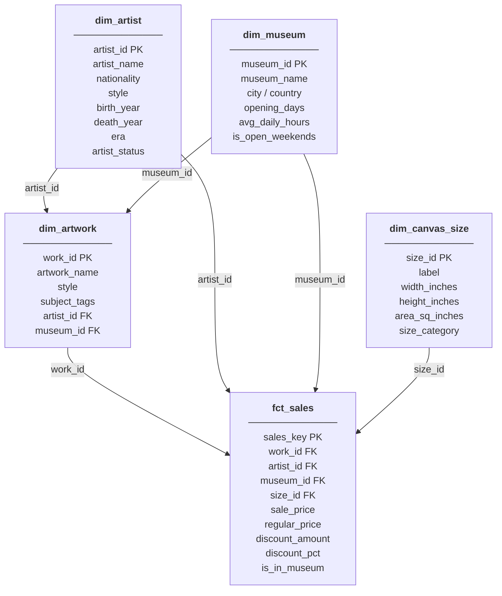
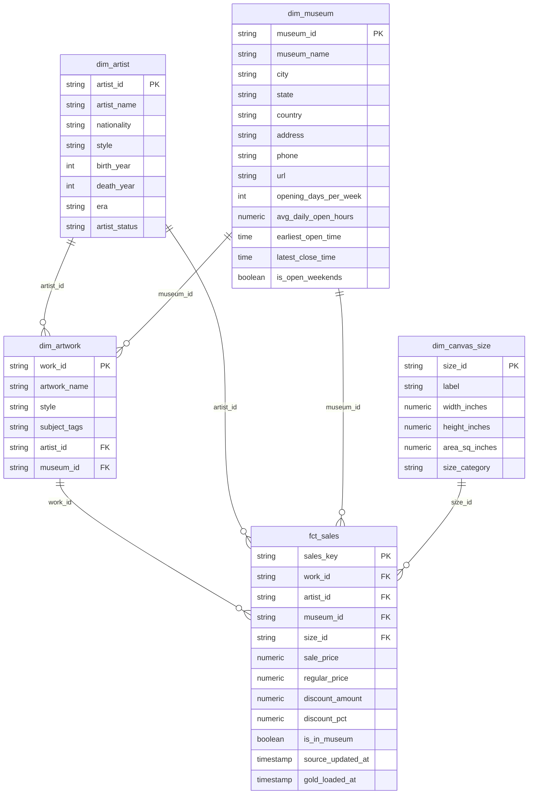

# Star Schema — Gold Layer

The gold layer follows a classic **star schema**: one central fact table surrounded by four dimension tables. All models live in the `gold` dbt schema and are materialized as tables.

---

## Star Schema Overview

---

## Entity Relationship Diagram

---

## Tables

### `fct_sales` — Fact Table

The grain is one row per **(work_id, size_id)** combination — i.e. one artwork listed in one canvas size. It is the central table that links all four dimensions.

| Column | Type | Description |
|--------|------|-------------|
| `sales_key` | PK | Surrogate key generated from `work_id + size_id` |
| `work_id` | FK → dim_artwork | The artwork being sold |
| `artist_id` | FK → dim_artist | The artist who created the artwork |
| `museum_id` | FK → dim_museum | The museum where the artwork is displayed (nullable) |
| `size_id` | FK → dim_canvas_size | The canvas size of the listing |
| `sale_price` | numeric | Discounted selling price |
| `regular_price` | numeric | Full list price |
| `discount_amount` | numeric | `regular_price - sale_price` |
| `discount_pct` | numeric | Discount as a percentage of regular price |
| `is_in_museum` | boolean | `TRUE` if the artwork is displayed in a museum |
| `source_updated_at` | timestamp | Last updated timestamp from source |
| `gold_loaded_at` | timestamp | When this row was loaded into gold |

> **Note:** Only artworks with a valid `size_id` that exists in `dim_canvas_size` are included. Duplicate `(work_id, size_id)` pairs from the source are de-duped by keeping the most recent `updated_at`.

---

### `dim_artwork` — Artwork Dimension

One row per artwork. Enriched with aggregated subject tags from the `subject` table.

| Column | Description |
|--------|-------------|
| `work_id` (PK) | Unique artwork identifier |
| `artwork_name` | Title of the artwork |
| `style` | Artistic style (nulls preserved as NULL) |
| `subject_tags` | Comma-separated list of subjects, e.g. `"Landscape,Nature"`. `'Unknown'` if none. |
| `artist_id` | FK → dim_artist |
| `museum_id` | FK → dim_museum |

---

### `dim_artist` — Artist Dimension

One row per artist. Includes two computed classification columns for BI slicing.

| Column | Description |
|--------|-------------|
| `artist_id` (PK) | Unique artist identifier |
| `artist_name` | Full name of the artist |
| `nationality` | Country of origin (`'Unknown'` if missing) |
| `style` | Artistic style (`'Unknown'` if missing) |
| `birth_year` | Year of birth |
| `death_year` | Year of death (NULL if living or unknown) |
| `era` | Computed from `birth_year` — see buckets below |
| `artist_status` | `'Historical'` if deceased, `'Living / Unknown'` otherwise |

**Era buckets:**

| Birth year range | Era label |
|-----------------|-----------|
| NULL | Unknown |
| < 1400 | Medieval & Earlier |
| 1400–1599 | Renaissance |
| 1600–1749 | Baroque & Rococo |
| 1750–1849 | Neoclassical & Romantic |
| 1850–1899 | Impressionist Era |
| 1900–1949 | Modern |
| ≥ 1950 | Contemporary |

---

### `dim_museum` — Museum Dimension

One row per museum. Enriched with computed hours statistics from the `museum_hours` table.

| Column | Description |
|--------|-------------|
| `museum_id` (PK) | Unique museum identifier |
| `museum_name` | Full name of the museum |
| `city` | City (`'Unknown'` if missing) |
| `state` | State/region |
| `country` | Country (`'Unknown'` if missing) |
| `address` | Street address |
| `phone` | Contact number |
| `url` | Website URL |
| `opening_days_per_week` | How many days per week the museum is open (`0` if no hours data) |
| `avg_daily_open_hours` | Average hours open per day |
| `earliest_open_time` | Earliest opening time across all days |
| `latest_close_time` | Latest closing time across all days |
| `is_open_weekends` | `TRUE` / `FALSE` / `NULL` (if no hours data) |

---

### `dim_canvas_size` — Canvas Size Dimension

One row per canvas size. Includes two computed columns for BI grouping and sorting.

| Column | Description |
|--------|-------------|
| `size_id` (PK) | Unique size identifier |
| `label` | Human-readable size label (`'Unknown'` if missing) |
| `width_inches` | Width in inches |
| `height_inches` | Height in inches |
| `area_sq_inches` | Computed: `width × height`, rounded to 2 decimal places (NULL if either dimension is missing) |
| `size_category` | Computed bucket: `Small` (≤400), `Medium` (≤1600), `Large` (≤4000), `Extra Large` (>4000), `Unknown` |

---

## Relationships

| From | Key | To | Cardinality |
|------|-----|----|-------------|
| `fct_sales` | `work_id` | `dim_artwork` | Many-to-one |
| `fct_sales` | `artist_id` | `dim_artist` | Many-to-one |
| `fct_sales` | `museum_id` | `dim_museum` | Many-to-one (nullable) |
| `fct_sales` | `size_id` | `dim_canvas_size` | Many-to-one |
| `dim_artwork` | `artist_id` | `dim_artist` | Many-to-one |
| `dim_artwork` | `museum_id` | `dim_museum` | Many-to-one |

> `museum_id` in `fct_sales` can be NULL — artworks not displayed in any museum still appear in the fact table with `is_in_museum = FALSE`.

---

## Data Quality

The gold layer runs **41 dbt tests** after every load, gated at a 95% pass-rate threshold. Any failure exits with code 1 and writes a JSON report to `watermark/gold/`. Unlike the silver layer, no warnings are expected in gold — any `WARN` is treated as unexpected and flagged for investigation.